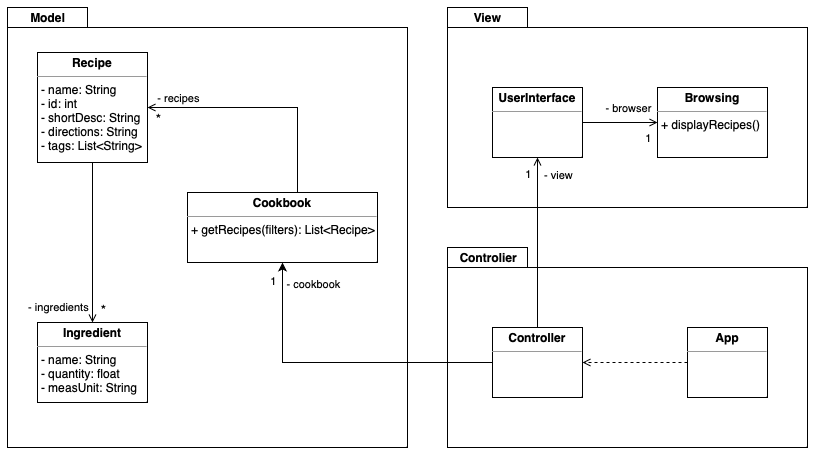
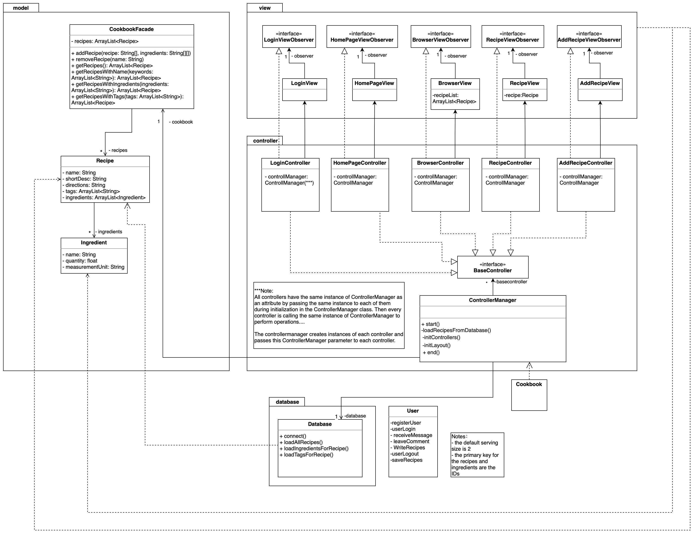
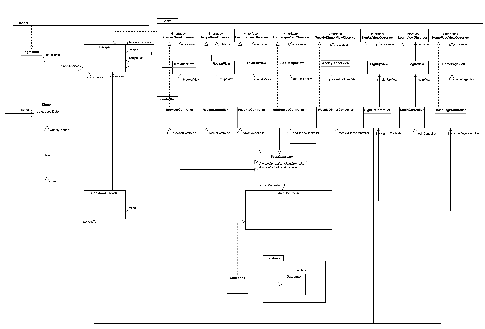

# The progression of our class diagram

The following diagrams are showing the state of our code structure at the end of each sprint starting from sprint 2 and going all the way up to sprint 6.

## Sprint 2

## Sprint 3

## Sprint 4

## Sprint 5

## Sprint 6
